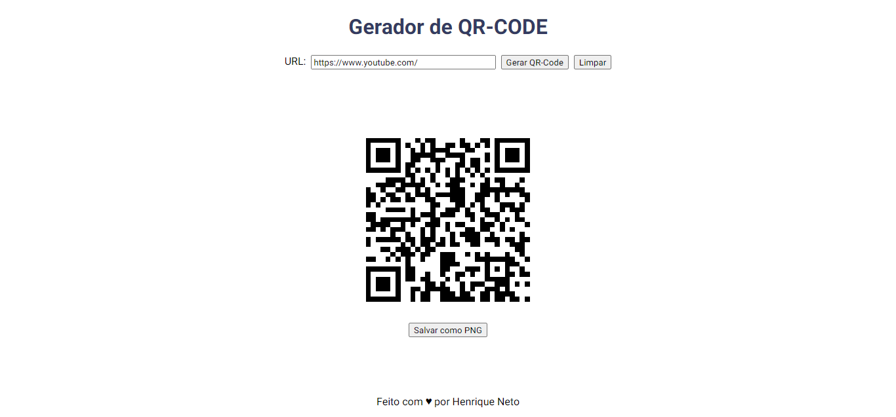

# Gerador de QR-Code

Projeto de um gerado de QR-Code usando HTML, CSS e Javascript. O objetivo é inserir uma URL ou nome e após isso gerar uma imagem qr-code. Para a geração do qr-code foi utilizada a biblioteca **qrcode.js**. Para salvar o qrcode em imagem png, foi usada a biblioteca **html2canvas.js**. O projeto está hospedado em:

## Design do Projeto



## Bibliotecas usadas

### QrCode

Gera um qr-code dentro de um elemento **canva** com uma tag **img** contento a imagem.

#### Instalação via CDN

Link para o CDN: https://cdnjs.com/libraries/qrcodejs. Para usar, basta inserir o código abaixo:

```
<script src="https://cdnjs.cloudflare.com/ajax/libs/qrcodejs/1.0.0/qrcode.min.js"></script>
```

> [!NOTE]
> A biblioteca só gera o elemento canva com a imagem, não possibilitando baixar o qr-code gerado.

### Html2Canvas

Gera uma imagem png de algum elemento html.

#### Instalação via CDN

Link da CDN: https://cdnjs.com/libraries/html2canvas. Para usar, basta inserir o código abaixo:

```
<script src="https://cdnjs.cloudflare.com/ajax/libs/html2canvas/1.4.1/html2canvas.min.js"></script>
```
